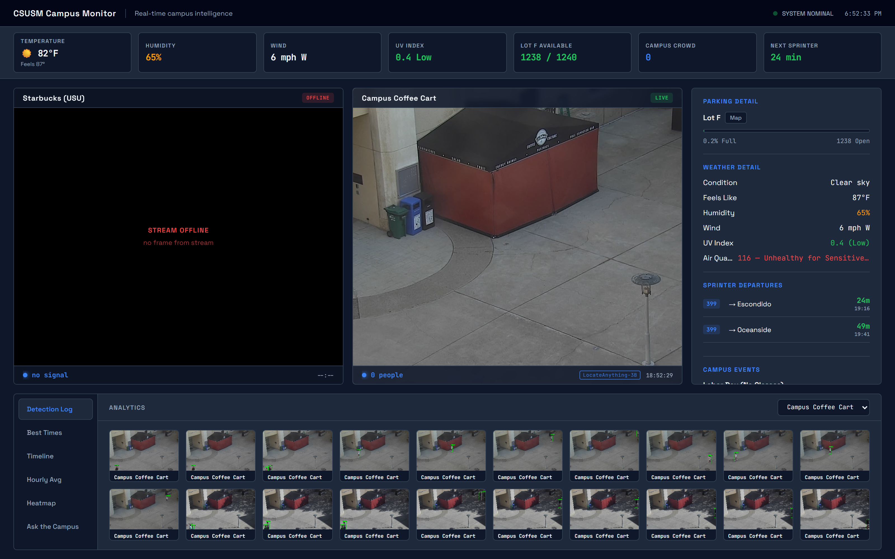
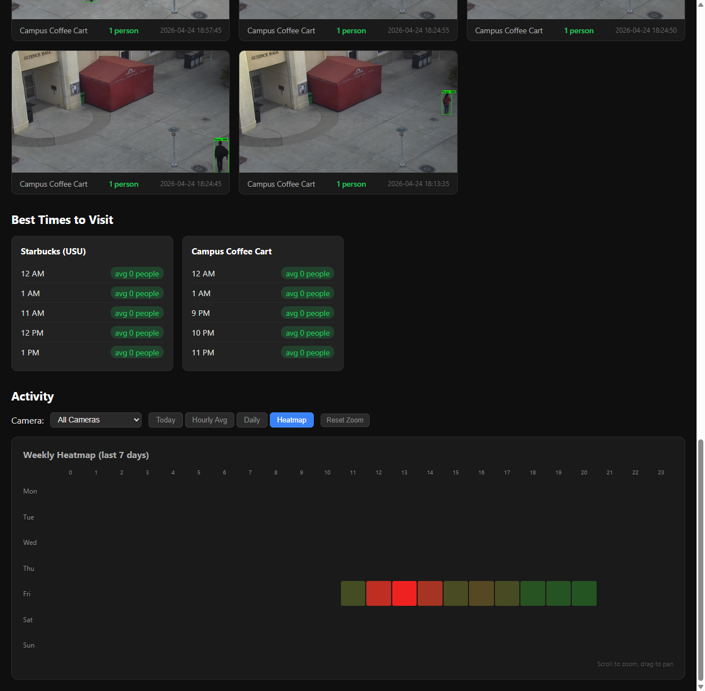

# CSUSM Campus Monitor

[](https://github.com/ethanstoner/csusm-monitor/actions/workflows/ci.yml)

**Open-vocabulary occupancy monitoring for campus locations, from live video streams.**

Built to solve a real problem: CSUSM's Starbucks and Coffee Cart have no way to tell how busy they are before you walk across campus. This project taps into the university's public HLS camera streams, detects people in each frame, and serves a live dashboard showing current crowd counts, historical trends, and the best times to visit.

Detection runs on [NVIDIA LocateAnything-3B](https://huggingface.co/nvidia/LocateAnything-3B), an open-vocabulary grounding model, so the system is not limited to the one class a detector was trained for — you can ask it how many **bicycles** are at the rack, or how long the **queue** is, in English, with no retraining. It falls back to YOLOv8n automatically when the GPU service is unreachable, so the dashboard still works on a machine without one.

### Live Feeds & Detection Log


### Analytics — Best Times & Weekly Heatmap


---

## The Problem

CSUSM students waste time walking to campus food spots only to find long lines. The university streams live camera feeds from these locations, but there's no occupancy data — just raw video. Students have no way to check crowd levels before committing to the walk.

## The Solution

I built a full-stack monitoring system that:

1. **Captures frames** from CSUSM's live HLS camera streams using ffmpeg
2. **Detects people** with LocateAnything-3B, an open-vocabulary grounding model prompted in English — falling back to YOLOv8n (plus a filter for its stationary false positives) whenever the GPU service is unreachable
3. **Stores counts** in SQLite with time-series indexing, tagged with which model produced each reading
4. **Serves a dashboard** with live video, real-time counts, heatmaps, and "best times to visit" recommendations

The system runs a detection cycle every 5 seconds per camera and can optionally offload detection to [Frigate NVR](https://frigate.video) via MQTT as a third backend.

**Measured, on 820 frames with hand-labelled ground truth** spanning daylight, dusk and six hours of night. Across 33 people, **YOLOv8n finds 20 and LocateAnything finds 31**; neither invents anybody. The misses are not marginal — two people standing at the cart in plain view, two more walking across a lit plaza at night. The grounding model costs **69× more per frame** for that. Both numbers are the point, and both are in **[bench/README.md](bench/README.md)**, along with the five defects found getting there and one measurement that overturned a design decision made three commits earlier.

---

## Architecture

```
CSUSM HLS Streams
       |
       v
  +-----------+     +--------------------------+
  |  ffmpeg   | --> |     PersonCounters       |
  | (capture) |     |  picks a backend/cycle   |
  +-----------+     +--------------------------+
       |               |                    |
       |          primary               fallback
       |               v                    v
       |     +---------------------+  +-------------+
       |     | LocateAnything-3B   |  |  YOLOv8n    |
       |     | (HTTP, separate     |  |  + Static   |
       |     |  process, GPU)      |  |  ObjectFilt |
       |     +---------------------+  +-------------+
       |               |                    |
       |               +---------+----------+
       |                         v
       |               +---------------------+
       |               |  SQLite (WAL)       |
       |               |  detections.source  |  <- which model counted
       |               +---------------------+
       v                         |
  +-----------+                  v
  | HLS Proxy | <-------> +------------+      +------------+
  | (CORS fix)|           |  FastAPI   | ---> | Dashboard  |
  +-----------+           |  REST API  |      | hls.js +   |
                          +------------+      | Chart.js   |
                                              +------------+
```

The grounding model is primary and YOLO is the fallback, chosen per cycle. A failed
probe is cached for `VLM_PROBE_INTERVAL` so a machine with no GPU does not pay a
connection timeout every five seconds. Only transitions are logged, and every stored
row records which model produced it — a detector that can change underneath a heatmap
has to leave a trail.

**Open-vocabulary queries** ("how many bicycles", "how long is the queue") run on a
separate slow loop against the same captured frame, writing to their own `observations`
table so a bicycle count never mixes into person-count history:
```
captured frame --> LocateAnything-3B --> observations table
   (every 300s)                          (camera, label, count)
```

**Optional Frigate path** (third backend, MQTT):
```
CSUSM HLS Streams --> Frigate (Docker) --> MQTT --> FastAPI --> SQLite
```

### Key Components

| Component | File | Purpose |
|---|---|---|
| **Detection Worker** | `backend/detector.py` | Captures HLS frames via ffmpeg, runs the selected detector, applies YOLO-specific filtering, saves annotated snapshots |
| **Backend Selection** | `backend/detector.py` (`PersonCounters`) | Prefers LocateAnything-3B, falls back to YOLOv8n on any service failure, caches failed probes, logs only transitions |
| **Frigate Listener** | `backend/frigate_listener.py` | MQTT subscriber that receives person counts from Frigate NVR as an alternative detection backend |
| **Open-Vocabulary Backend** | `backend/vlm.py` | Decodes LocateAnything-3B coordinate tokens, talks to the grounding service, polls natural-language queries on a slow interval |
| **Grounding Service** | `services/locate_anything/server.py` | Out-of-process LocateAnything-3B host (Linux + NVIDIA GPU, optional) |
| **Database** | `backend/database.py` | SQLite with WAL mode, time-series schema with composite indexes, retention cleanup |
| **API Server** | `backend/main.py` | FastAPI app with lifespan management, HLS proxy, REST endpoints for status/history/heatmap |
| **Dashboard** | `frontend/index.html` | Dark-themed SPA with live video (hls.js), interactive charts (Chart.js), detection log with lightbox |
| **Config** | `backend/config.py` | All tunable parameters — detection thresholds, camera definitions, paths, timers |

---

## Technical Challenges & Solutions

### 1. False Positives from Stationary Objects (on the YOLO fallback path)
**Problem:** YOLOv8 at low confidence thresholds (needed to catch partially-occluded people) frequently misidentifies signs, poles, and furniture as people.

**Solution:** Built a `StaticObjectFilter` that tracks bounding box center positions over a 20-frame rolling window. Objects that remain within a 40px radius for 12+ consecutive frames are classified as stationary and suppressed. This eliminates false positives without hardcoding exclusion zones, and self-calibrates ~60 seconds after startup.

The self-calibration has a cost worth naming: for those first 12 frames the filter has no history, so it passes everything through and the counts are inflated by exactly the objects it exists to remove. Those counts are shown live but deliberately **not** written to the database, because every trend in the dashboard is an average and a restart would otherwise bake a minute of false positives into the seven-day view.

Benchmarking later showed the grounding model has *the same* failure — prompted `"person"` it called the plaza's trash receptacles people too. It is not filtered there, because a filter that suppresses anything holding still would also erase someone standing in a queue, which is the flagship use case. It is fixed by prompt instead (challenge 10).

### 2. HLS Manifest Bloat
**Problem:** CSUSM's HLS streams never reset `EXT-X-MEDIA-SEQUENCE`, causing manifests to grow past 360KB by midday. hls.js would try to buffer from the playlist start, causing massive latency.

**Solution:** Built an HLS proxy that intercepts manifest requests, trims to only the last 6 segments, updates the media sequence counter, and caches the result for 3 seconds (just under one segment duration). Clients stay within ~24 seconds of live.

### 3. Corrupted / Dark Frames
**Problem:** HLS segments occasionally deliver black frames or static title cards (especially during stream restarts), causing false zero-counts.

**Solution:** Added pre-detection frame validation: brightness check (mean pixel value > 15) and edge density analysis (Canny edge detection, mean > 1.0) to skip corrupted and placeholder frames.

### 4. CORS Restrictions on University Streams
**Problem:** Browser-based HLS playback fails because CSUSM's stream server doesn't set CORS headers.

**Solution:** FastAPI proxies all `.m3u8` and `.ts` requests through `/api/stream/{camera_id}/`, transparently handling content types and caching.

### 5. Dual Detection Backend
**Problem:** Local YOLO detection works but is CPU-intensive. Wanted the option to offload to a GPU server without rewriting the app.

**Solution:** Designed a pluggable architecture — `DetectionWorker` (local YOLO) runs by default, and `FrigateListener` (MQTT subscriber for Frigate NVR) starts optionally alongside it. Both write to the same SQLite schema. The API layer merges live counts from whichever backend is active.

### 6. A Missing Camera Is Not the Same as an Empty One
**Problem:** These are public university streams and they go down. When one 404s, ffmpeg fails against it in about 0.2 seconds, so a fixed 5-second retry meant spawning a process and logging a warning twelve times a minute, indefinitely, for a camera that was never coming back that day. Worse, the resulting hole in the data was invisible downstream — an hour with four readings and an hour with seven hundred rendered identically in the heatmap.

**Solution:** Consecutive capture failures back off geometrically from 5s to a 60s ceiling and reset on the first good frame; a dark or static frame means the stream is alive, so those don't count as failures. The inter-cycle wait is an `Event`, so shutdown interrupts a backoff instead of waiting it out. Trend queries return a sample count per bucket, and the heatmap hatches any hour with sparse coverage so a gap reads as a gap rather than as a quiet hour.

### 7. A 200 OK That Means the Camera Is Gone
**Problem:** CSUSM took the Starbucks camera down, and the URL kept answering `200 OK` — with a zero-byte manifest. Everything downstream believed it. The HLS proxy forwarded a body of `b'\n'` as a valid playlist, so hls.js sat on a manifest it could never parse and the card spun indefinitely with no way to distinguish "loading" from "decommissioned". Worse, `/api/status` fell back to the newest row in the table for a camera that had not produced a frame since May, so a four-month-old crowd count was served as current occupancy and summed into the campus total.

**Solution:** The proxy now rejects an upstream response that carries no `#EXTINF` segment, returning `502` with an `X-Stream-Status: offline` header instead of a playlist that cannot work. Detection workers record capture outcomes in a shared health map; three consecutive failures mark a camera offline, and one good frame clears it, so a single dropped segment does not flap the dashboard. An offline camera reports `count: null` rather than a stale number, the dashboard renders an explicit offline card with the reason instead of mounting a doomed video element, and the campus total excludes cameras that are not reporting rather than counting them as zero.

### 8. Counting Things Nobody Trained a Class For
**Problem:** The monitor counted exactly one thing, because YOLOv8n was trained to. Every question beyond "how many people" — how many bicycles are at the rack, how long the queue is as distinct from people merely standing nearby — needed a different model or a fine-tune, which is a semester of labelling rather than a weekend.

**Solution:** Switched person detection to [`nvidia/LocateAnything-3B`](https://huggingface.co/nvidia/LocateAnything-3B), an open-vocabulary grounding model prompted in English. The same weights that count people also answer anything else you can name, so the product stopped being "occupancy" and started being "ask the campus a question" — with no retraining and no labelled data.

**The measurements justify this, but only on scenes hard enough to test it.** On an easy daylight set the two backends are indistinguishable. Across the two harder sets — 640 frames through dusk and into the night — YOLOv8n misses **13 of 26 people**, including `frame_233`, two people standing at the cart, fully visible, reported as zero — while LocateAnything misses 2. For a product whose whole job is telling you whether the cart is busy, that is a failure of the core function, and it is invisible without ground truth because the wrong counts look perfectly plausible.

The grounding model costs **69× more per frame** (1,215 ms vs 17.6 ms) and 14.5 GB of VRAM for that. And prompt it `trash can` and it finds all six on a frame YOLO has no class for:


### 9. A Model That Needs a GPU on Another Operating System
**Problem:** LocateAnything-3B is Linux-only, needs an NVIDIA GPU, and is licensed for non-commercial research. Making it the detector naively means the dashboard shows nothing at all for anyone who clones this without a 4090 — and the whole point of a portfolio repo is that it runs.

**Solution:** `PersonCounters` picks a backend per cycle. LocateAnything is primary; the moment its service fails to answer, YOLOv8n takes over and the dashboard keeps counting. Recovery is automatic. Three details make it behave rather than thrash:

- **Failed probes are cached** (`VLM_PROBE_INTERVAL`, 60s). Without this, a machine with no GPU pays a connection timeout on every 5-second cycle.
- **Only transitions are logged**, so a permanently-GPU-less install produces one warning, not one every cycle.
- **Every row records its `source`.** A detector that can change underneath a heatmap has to leave a trail, or an average computed across two models is uninterpretable afterwards. `/api/history/sources` reports the mix.

`StaticObjectFilter` stays on the YOLO path only. It was built and validated against YOLO's specific failure mode — calling signs and poles people at a 0.45 threshold — and it works by suppressing anything that holds still. Pointed at a grounding model it would equally suppress a person sitting at a table: a real detection removed to fix a problem that model may not have. A pleasant consequence is that the grounding path has no ~60-second warm-up discard, because there is no filter to warm up.

Verified by killing the GPU service mid-run and watching the switch happen, then restarting it and watching it switch back:

```
18:47:58  Detected 0 people (LocateAnything-3B)
18:48:04  WARNING  Grounding service unavailable (ConnectError) — falling back to yolov8n
18:48:55  Detected 0 people (yolov8n)
18:50:15  INFO     Grounding service reachable — counting people with LocateAnything-3B
```

### 10. The Fix for a Hallucinating Detector Was One Word
**Problem:** Prompted with the obvious string, `"person"`, LocateAnything found every one of the 21 people in the dusk set — and invented 6 more. Four of those were the plaza's trash receptacles, repeatedly reported as people. That is precisely the failure `StaticObjectFilter` was written for, so the grounding model does not escape it by being smarter; it has the same problem.

**Solution:** Prompted `"pedestrian"` instead, on identical frames and identical settings, the false positives went to **zero** — trash cans included — costing 2 in recall (both figures more than half outside the frame). Frame-exact accuracy went 97.5% → **99.2%**.

| Prompt | Found (truth 21) | Missed | Invented |
|---|---|---|---|
| `person` | 27 | 0 | 6 |
| **`pedestrian`** | 19 | 2 | **0** |
| `student` | 19 | 2 | **0** |
| `person walking` | 18 | 3 | **0** |

This is the case for open-vocabulary detection stated as plainly as it gets. YOLOv8n's precision/recall balance is fixed at training time — the only knobs are a confidence threshold and a hand-written filter for one specific failure mode. Here the same trade was made by editing a string, measured in about four minutes. `PERSON_QUERY` in `backend/config.py` holds that string and defaults to the measured winner, with a test asserting it so nobody reverts a measured result by accident.

Five defects had to be found and fixed before any of this was trustworthy, including a sampling default that made the same frame return different counts on 4 of 5 tries, a generation runaway that returned 340 boxes for a 6-object query with every box individually well-formed, and three real people I had missed while hand-labelling that the model correctly found and was scored against. All of it, with the numbers, is in **[bench/README.md](bench/README.md)**.

> **Licence note.** The MIT `LICENSE` at the root covers *this code*. It does not cover the LocateAnything-3B weights, which are released under the [NVIDIA License](https://huggingface.co/nvidia/LocateAnything-3B/blob/main/LICENSE) for **academic and non-profit research purposes only**. That is why this backend is off unless `VLM_ENABLED=1`, why the model runs behind a process boundary rather than being imported, and why nothing in this repo ships the weights. If you clone this and intend to deploy it commercially, that backend has to be swapped for something you are licensed to use.

---

## Features

- **Live Video Feeds** — HLS streams proxied through FastAPI with hls.js playback
- **Real-time People Counts** — Updated every 5 seconds with health status indicators
- **Detection Snapshots** — Annotated JPEG captures with bounding boxes when people are detected
- **Weekly Heatmap** — Day-of-week × hour-of-day grid showing average crowd density
- **Hourly Averages** — 30-day rolling average by hour, filterable by weekday/weekend
- **Daily Trends** — Total and average counts per day with interactive zoom/pan
- **Best Times to Visit** — Ranked hours by lowest average crowd, scoped to each location's opening hours
- **Campus Context** — Weather, air quality, parking availability, Sprinter departures and upcoming events alongside the feeds
- **Open-Vocabulary Detection** — People counted by a grounding model prompted in English, not a fixed class list
- **Automatic Backend Fallback** — YOLOv8n takes over transparently when the GPU service is unreachable, and the dashboard says which model is running
- **Ask the Campus** — Natural-language queries beyond person counting, on their own schedule and their own table
- **Coverage Honesty** — Hours backed by too few readings are marked, so outages don't masquerade as quiet periods; a camera that is down reports no count rather than its last one
- **Automatic Data Cleanup** — Retention policy deletes rows older than 30 days

---

## Tech Stack

| Layer | Technology |
|---|---|
| **Detection (primary)** | NVIDIA LocateAnything-3B (Qwen2.5-3B + MoonViT), PyTorch, CUDA |
| **Detection (fallback)** | YOLOv8 (ultralytics), OpenCV, ffmpeg |
| **Backend** | Python, FastAPI, SQLite (WAL mode), paho-mqtt |
| **Frontend** | Vanilla JS, hls.js, Chart.js (with zoom plugin) |
| **Infrastructure** | Docker Compose (full stack), Dockerfile, uvicorn |

---

## Quick Start

### Docker (recommended)

**Requirements:** Docker + Docker Compose

```bash
git clone https://github.com/ethanstoner/csusm-monitor.git
cd csusm-monitor
docker compose up -d
```

That's it — opens the dashboard at [http://localhost:8000](http://localhost:8000). The compose file brings up the FastAPI backend on its own, with the YOLOv8n weights baked into the image at build time. Detection runs on the YOLO fallback path here: LocateAnything-3B needs an NVIDIA GPU and is not part of this stack.

The Frigate and Mosquitto configs under `frigate/` and `mosquitto/` are for running that optional third backend yourself; they are not wired into `docker-compose.yml`.

### Local development (no Docker)

**Requirements:** Python 3.12+, ffmpeg on PATH

```bash
git clone https://github.com/ethanstoner/csusm-monitor.git
cd csusm-monitor

# Option A: One-click (Windows)
start.bat

# Option B: Manual
python -m venv venv

# Linux / macOS
venv/bin/pip install -r backend/requirements.txt
venv/bin/python -m uvicorn backend.main:app --host 0.0.0.0 --port 8000

# Windows
venv\Scripts\pip install -r backend\requirements.txt
venv\Scripts\python -m uvicorn backend.main:app --host 0.0.0.0 --port 8000
```

Open [http://localhost:8000](http://localhost:8000)

---

## API Endpoints

| Method | Endpoint | Description |
|---|---|---|
| `GET` | `/api/status` | Current count + health per camera |
| `GET` | `/api/cameras` | Camera list with proxied stream URLs |
| `GET` | `/api/detection-log` | Recent detection snapshots (Frigate or local) |
| `GET` | `/api/cameras/{id}/hours` | Operating-hours window analytics are scoped to |
| `GET` | `/api/history/heatmap?camera=X` | Day × hour average counts, with sample counts |
| `GET` | `/api/history/hourly?camera=X` | Hourly averages (weekday/weekend filter) |
| `GET` | `/api/history/timeline?camera=X` | Minute-by-minute time series |
| `GET` | `/api/history/best-times?camera=X` | Hours ranked by lowest crowd, within opening hours |
| `GET` | `/api/history/daily?camera=X` | Daily totals and averages |
| `GET` | `/api/history/sources?camera=X` | Which detectors produced a camera's history, and how much of it |
| `GET` | `/api/observations` | Latest open-vocabulary count per (camera, label) |
| `GET` | `/api/observations/history?camera=X&label=Y` | Hourly averages for one label |
| `GET` | `/api/conditions` | Latest weather and air quality |
| `GET` | `/api/parking` | Latest campus parking availability |
| `GET` | `/api/parking/trends?lot=X` | Parking availability by day × hour |
| `GET` | `/api/transit` | Next NCTD Sprinter departures from CSUSM |
| `GET` | `/api/events` | Upcoming campus events |
| `GET` | `/api/stream/{id}/{path}` | HLS proxy (manifest trimming + CORS) |

---

## Running Tests

```bash
pytest -v
```

133 tests covering the API layer, database and trend queries, the data collectors' HTML/GTFS parsing, configuration validation, the `StaticObjectFilter` and detection-worker lifecycle (backoff, prompt shutdown, warm-up suppression), camera-health and offline-stream handling, detection-backend selection and fallback, the open-vocabulary box decoder and every grounding-service failure mode (unreachable, timeout, malformed payload, runaway generation), the Frigate MQTT listener, and a full integration smoke test with a mocked detection pipeline.

---

## Project Structure

```
csusm-monitor/
├── backend/
│   ├── main.py              # FastAPI app, lifespan, API routes
│   ├── detector.py           # YOLOv8 detection worker + frame filters
│   ├── collectors.py         # Weather, parking, AQI, transit, events collectors
│   ├── frigate_listener.py   # MQTT subscriber for Frigate NVR
│   ├── vlm.py                # Open-vocabulary backend: box decoding + worker
│   ├── database.py           # SQLite schema, queries, cleanup
│   ├── config.py             # All tunable parameters
│   └── requirements.txt
├── services/
│   └── locate_anything/
│       └── server.py         # Out-of-process LocateAnything-3B HTTP service
├── bench/
│   ├── README.md             # Measured latency, VRAM, accuracy; how to reproduce
│   ├── la3b_bench.py         # LocateAnything-3B benchmark harness
│   ├── yolo_bench.py         # YOLOv8n baseline over the same frames
│   ├── capture_frames.sh     # Freeze a benchmark frame set from a live stream
│   └── sweep_resolution.sh   # Latency/VRAM/recall vs input resolution
├── frontend/
│   └── index.html            # Dashboard SPA
├── frigate/
│   └── config.yml            # Frigate camera config
├── mosquitto/
│   └── mosquitto.conf        # MQTT broker config
├── tests/
│   ├── test_api.py           # API endpoint tests
│   ├── test_collectors.py    # Collector parsing + collector API tests
│   ├── test_config.py        # Configuration validation
│   ├── test_database.py      # SQLite schema & query tests
│   ├── test_detector.py      # StaticObjectFilter + worker lifecycle tests
│   ├── test_frigate_listener.py  # MQTT listener unit tests
│   ├── test_vlm.py           # Box decoding, service failure modes, worker
│   └── test_integration.py   # End-to-end smoke test
├── Dockerfile                # Backend container (Python + ffmpeg + YOLO)
├── .dockerignore             # Docker build exclusions
├── docker-compose.yml        # Full stack: monitor + Frigate + Mosquitto
├── start.bat                 # One-click Windows launcher
└── .env.example              # Environment variable template
```

---

## Skills Demonstrated

- **Computer Vision** — YOLOv8 object detection with custom post-processing (static object filtering, frame validation)
- **Full-Stack Development** — Python backend + JavaScript frontend, REST API design, real-time data visualization
- **Systems Integration** — HLS video proxying, MQTT pub/sub, Docker containerization, multi-backend architecture
- **Data Engineering** — Time-series SQLite schema design with composite indexes, WAL mode for concurrent reads, automated retention
- **Problem Solving** — Each technical challenge (manifest bloat, false positives, CORS, dark frames) required a distinct engineering approach rather than an off-the-shelf solution
