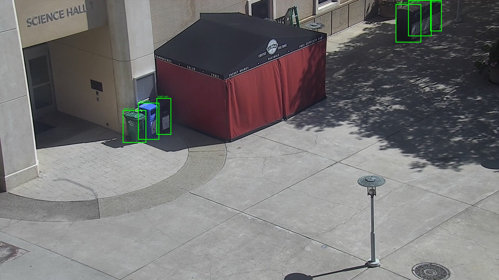
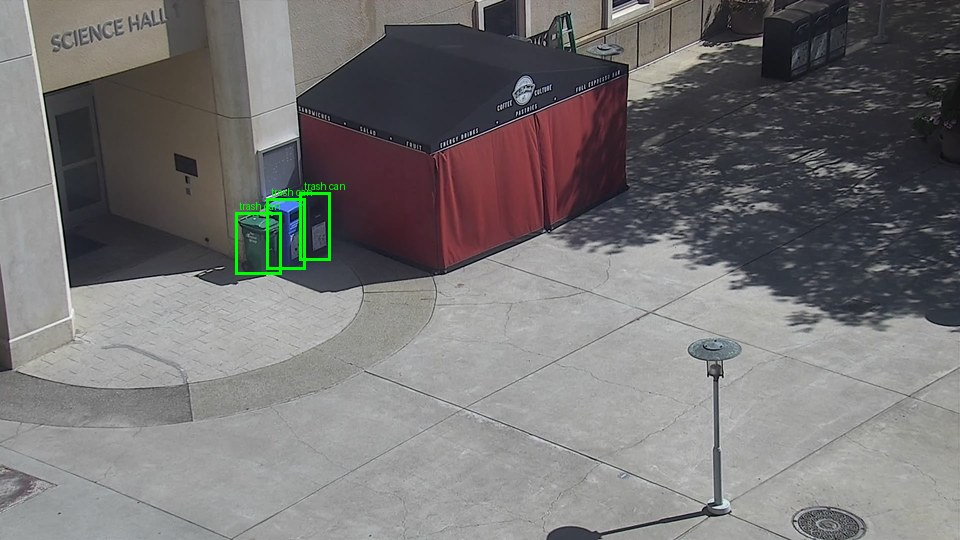
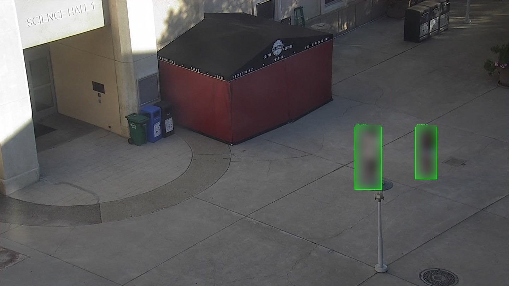

# Benchmarks — YOLOv8n vs NVIDIA LocateAnything-3B

Everything here was measured on the machine this project runs on, against real
frames pulled from the CSUSM Coffee Cart stream. No number on this page is
copied from a model card.

**Hardware:** RTX 4090 (24 GB, Ada, compute 8.9) · WSL2 Ubuntu on Windows 11 ·
torch 2.11.0+cu128 · transformers 4.57.1 · attention backend `sdpa`
(FlashAttention and MagiAttention both fall back on this GPU).

**Frame sets**, all 1920×1080 from `https://stream.csusm.edu/coffeecart.m3u8`,
frozen with `bench/capture_frames.sh` so every backend scores identical pixels:

| Set | Frames | When | Labelled | People |
|---|---|---|---|---|
| `frames` | 60 | 15:15–15:35, 20s apart | no (empty scene) | 0 |
| `frames_people` | 180 | 16:05–19:05, 40s apart | yes | 7 |
| `frames_people2` | 240 | 18:06–19:06, 15s apart | yes | 21 |

Reproduce with `bench/yolo_bench.py`, `bench/la3b_bench.py`,
`bench/sweep_resolution.sh` and `bench/compare.py`. Raw per-frame results are
the `*.json` files in `bench/results/`; hand-written ground truth is
`bench/people_labels.json` and `bench/people2_labels.json`.

---

## The headline

LocateAnything-3B does something YOLOv8n cannot do at all — count a category
nobody trained a class for, asked in English — and it costs **roughly 69× more
per frame** to do it.

| | YOLOv8n | LocateAnything-3B (1440px) |
|---|---|---|
| Median latency / frame | **17.6 ms** | **1,215 ms** |
| p95 latency | 20.8 ms | 1,331 ms |
| Peak VRAM | negligible | 14.5 GB |
| Frame-exact accuracy (240 harder labelled frames) | 233/240 | **238/240** |
| People missed (of 21) | **11** | **2** |
| People invented | 0 | 0 |
| Categories | 1 (`person`, filtered from COCO's 80) | anything you can name |
| Adding a category | retrain or fine-tune | edit a string in `config.py` |
| Runs without a GPU | yes | no |

**The grounding model is the primary detector, and it earns that on accuracy as
well as capability** — but only once its prompt was tuned, and only on a scene
hard enough to tell the two apart. On an easy daylight set they tie exactly. On
a dusk set with people at frame edges and in shadow, YOLOv8n misses 11 of 21
people and LocateAnything misses 2. The cost is 69× the latency and a hard
dependency on a Linux host with an NVIDIA GPU, which is exactly why YOLOv8n
stayed in the codebase as an automatic fallback rather than being deleted.

The rest of this page is the evidence, including five defects that had to be
found and fixed before any of it could be trusted — two of them only visible by
running the whole pipeline, and one of them mine rather than the model's.

---

## Things that had to be fixed before any of it was trustworthy

### 1. The published box order is ambiguous, and one of the two is wrong

The model emits coordinates as dedicated `<0>`–`<1000>` vocabulary tokens inside
`<box>…</box>`. The model card documents the order as `x1 y1 x2 y2`;
`generate_utils.py`, shipped in the same snapshot, says `x1 x2 y1 y2` in its
docstring. Both decode without error, and both produce plausible-looking
rectangles — so this cannot be settled by reading, only by looking.

Prompting `trash can` against a frame with six visible receptacles and drawing
the result settles it: **`x1 y1 x2 y2` is correct.**

That is also the first real demonstration of the point of the whole exercise:
`trash can` is not a class YOLOv8n has, and no training happened.

### 2. The shipped runtime samples, so the same frame returns different counts

`generate_batch_hybrid` defaults to `temperature=0.7, top_p=0.9`. For a demo
that is harmless. For a counter it is not: the number changes when nothing in
the world did, and a stored time series nobody can reproduce is not worth
storing.

Measured over 5 frames × 5 repeats each, same pixels every time:

| | temperature 0.7 (shipped default) | temperature 0 |
|---|---|---|
| Frames that disagreed with themselves | **4 of 5** | **0 of 5** |
| Largest spread on one frame | 2 (3 → 5) | 0 |
| Median latency | 1,046 ms | 1,044 ms |
| Mean count found (ground truth 6) | 3.0 | **4.0** |

Determinism was free — identical latency to the millisecond — and greedy
decoding found *more* objects, not fewer. The service runs greedy
(`--temperature 0`), and the benchmark harness always passes sampling
parameters explicitly so every result file records the settings that produced
it.

### 3. Native resolution is where the recall is, and it does not fit on the card

MoonViT tokenises at the image's native resolution, so a 1920×1080 campus frame
is by far the largest cost in the pipeline. Sweeping it, greedy, 8 frames each,
same static scene, ground truth **6** receptacles:

| Longest side | Median | p95 | Peak VRAM | Mean found | Per-frame counts |
|---:|---:|---:|---:|---:|---|
| 1920 (native) | 38,242 ms | 50,159 ms | **25.75 GB** | **6.12 / 6** | 6 6 7 6 6 6 6 6 |
| 1600 | 2,195 ms | 2,448 ms | 17.09 GB | 4.12 / 6 | 5 4 4 4 4 4 4 4 |
| **1440** | **1,308 ms** | **1,408 ms** | **13.69 GB** | **4.12 / 6** | 5 4 4 4 4 4 4 4 |
| 1280 | 1,020 ms | 1,070 ms | 11.61 GB | 3.88 / 6 | 5 4 5 3 3 4 3 4 |
| 960 | 486 ms | 639 ms | 9.24 GB | 3.62 / 6 | 4 3 3 3 4 4 4 4 |
| 640 | 260 ms | 480 ms | 8.24 GB | 3.62 / 6 | 4 3 5 4 4 3 3 3 |
| 448 | 307 ms | 329 ms | 8.07 GB | 3.00 / 6 | 3 3 3 3 3 3 3 3 |

Two things fall out of this, and neither was obvious beforehand.

**The accuracy cliff is at the very top, not spread across the range.** Full
recall exists only at native resolution. Drop one step to 1600 and a third of
the objects vanish — then recall is almost flat from 1600 all the way down to
640 while latency falls 8×. There is no gentle quality/speed dial here; there is
one expensive setting that sees everything and a broad plateau that sees the
near half of the frame.

**The setting that sees everything does not fit in 24 GB.** Native resolution
peaks at 25.75 GB allocated on a 24 GB card, so it spills to host memory — which
is exactly why it costs 38 seconds a frame instead of the ~3 that its pixel
count would suggest. The 4090 is listed as supported hardware, and it is, but
not at this input size. A card with more memory would change this row and no
other.

What gets lost is the far half of the frame: at 1440 the three receptacles
beside the cart are found every time and the three by the distant wall are not.

**1440 is the operating point**, and it is chosen from this table rather than
from taste: identical recall to 1600 at 60% of the latency, and 13.7 GB leaves
enough headroom that the service does not have the card to itself.

---

## Head to head on `person`, over all 60 frames

Both backends scored the identical frame set.

| | YOLOv8n | LocateAnything-3B @1440 | LocateAnything-3B @1920 |
|---|---|---|---|
| Frames scored | 60 | 60 | 8 |
| People reported | **0** | **0** | **0** |
| False positives | 0 | 0 | 0 |
| Median latency | 17.6 ms | 1,234 ms | 34,865 ms |
| Peak VRAM | negligible | 14.3 GB | 25.8 GB |

The plaza is genuinely empty in all 60 frames, so the two backends agree
perfectly — and the only thing that agreement proves is that **neither
hallucinates a person on an empty scene**. That is worth knowing: the entire
reason `StaticObjectFilter` exists is that YOLOv8n at a 0.45 confidence
threshold calls signs and poles people, and on this scene, in daylight, it does
not. It is not evidence about either model's accuracy when there *are* people
present. See below.

---

## A fourth thing, found by running the whole pipeline instead of the harness

The benchmarks above all pass `top_p=0.9`. The service was initially written to
pass `top_p=None` alongside `temperature=0`, on the reasoning that greedy
decoding ignores nucleus sampling anyway. It does not. Through the live service,
against a frame the harness scores correctly, that configuration produced:

| Query | Correct answer | Returned |
|---|---|---|
| `trash can` | 6 | **340 boxes**, 32.7 s |
| `red tent` | 1 | **175 boxes**, 29.0 s |
| `lamp post` | 1 | 2 boxes, one of them the entire frame |

Generation ran to the token budget instead of stopping. Every individual box was
well formed — correct token count, in-grid coordinates, non-inverted — so none
of the per-box validation caught any of it.

Two fixes, and the second matters more than the first:

1. The service passes `top_p=0.9`, the configuration everything here was
   measured under, with a comment saying why it must not be "simplified".
2. `LocateAnythingClient` discards any answer over `MAX_PLAUSIBLE_BOXES` (100)
   and records nothing for that cycle. A count two orders of magnitude too large
   entering a table that gets averaged is worse than a gap, and no amount of
   per-box checking would have stopped it.

**Verified against the live model**, same frame, same client, same service, only
the `top_p` default changed:

| Query | Correct | `top_p=None` | `top_p=0.9` |
|---|---|---|---|
| `trash can` | 6 | 340 boxes, 32.7 s | 4 boxes, 2.4 s |
| `red tent` | 1 | 175 boxes, 29.0 s | **1**, 1.2 s |
| `lamp post` | 1 | 2 boxes (one the whole frame) | **1**, 1.1 s |
| `person` | 0 | 0 | 0, 1.1 s |

Root cause confirmed: greedy decoding does not ignore nucleus sampling in this
runtime. The 25× latency difference was the model generating to the token
budget, not the model thinking harder.

---

## Counting people on a harder set, and the one-word fix

A second labelled set, `bench/frames_people2`: 240 frames, 15 seconds apart,
18:06–19:06 PDT, afternoon into dusk. Same labelling method as below — every
frame reviewed, plus the frames bracketing each run of pedestrians. **21 people
across 13 frames**, 227 empty.

This set separates the two backends completely, where the first one could not.

| | YOLOv8n | LocateAnything-3B `"person"` | LocateAnything-3B `"pedestrian"` |
|---|---|---|---|
| Frames exactly correct | 233 / 240 (97.1%) | 234 / 240 (97.5%) | **238 / 240 (99.2%)** |
| People found (truth 21) | 10 | 21 | 19 |
| **Missed** | **11** | **0** | 2 |
| **Invented** | **0** | **6** | **0** |

**YOLOv8n misses over half the people.** Not marginal cases: `frame_233` is two
people standing at the cart, fully visible and unoccluded, reported as zero.
`frame_014` is two people in shadow beside the building, reported as zero. For a
product whose entire job is telling you whether the coffee cart is busy, missing
11 of 21 is a failure of the core function — and it is invisible without ground
truth, because the counts look plausible.

**LocateAnything-3B misses nobody, but hallucinates.** With the obvious prompt,
`"person"`, it found every one of the 21 and added 6 that were not there. Four
of those six were the same three trash receptacles by the far wall, repeatedly
called people — which is *exactly* the failure mode `StaticObjectFilter` was
written for. The grounding model does not escape that problem by being smarter;
it has it too.

**The fix was a word, not a filter.** Prompted `"pedestrian"` instead of
`"person"`, on identical frames and identical settings, the false positives went
to **zero** — including the trash cans — at a cost of 2 in recall. Both losses
are the same two figures entering at the very edge of frame in `frame_164` and
`frame_165`, more than half outside the image.

| Prompt | Found (truth 21) | Missed | Invented |
|---|---|---|---|
| `person` | 27 | 0 | 6 |
| `pedestrian` | 19 | 2 | **0** |
| `student` | 19 | 2 | **0** |
| `person walking` | 18 | 3 | **0** |

This is the argument for an open-vocabulary detector stated as plainly as it can
be. YOLOv8n's precision/recall balance is fixed at training time; the only knobs
are a confidence threshold and a post-hoc filter for one specific failure. Here
the same trade was made by editing a string, measured in about four minutes, and
it moved frame-exact accuracy from 97.5% to 99.2%. `PERSON_QUERY` in
`backend/config.py` is that string, and it defaults to the measured winner.

### A correction, kept in the record

The first version of `people2_labels.json` scored `"person"` with **9** false
positives, not 6. Three of the nine were real people that *I* had missed while
labelling — two entering at the bottom edge of `frame_164`, one in
`frame_165` — small enough that a contact sheet cannot resolve them. They were
only found by cropping and magnifying every disputed detection, which is now a
step in the method rather than an afterthought.

So the model was right and the ground truth was wrong, and the first scoring
punished it for being more careful than the person grading it. Hand-built ground
truth has its own error rate; `bench/people2_labels.json` records where mine was,
rather than quietly editing the numbers.

---

## Counting people on the easier set

A second set, `bench/frames_people`: 180 frames, 40 seconds apart, 16:05–19:05
PDT. This one has people in it.

**Ground truth was labelled by looking at all 180 frames**, tiled into contact
sheets by `bench/contact_sheet.py` — not by labelling the frames a detector
fired on. That distinction is the whole point: taking YOLO's positives as the
label set would bake its misses into the ground truth and make its recall 100%
by construction. Reviewed by eye, exactly 4 frames contain people, 7 people
total (`bench/people_labels.json`).

| | YOLOv8n | LocateAnything-3B @1440 |
|---|---|---|
| Frames scored | 180 | 180 |
| Frames with an exactly correct count | **180 / 180** | **180 / 180** |
| People found (truth: 7) | 7 | 7 |
| Missed | 0 | 0 |
| Invented | 0 | 0 |
| Median latency | 17.6 ms | 1,215 ms |
| Peak VRAM | negligible | 14.5 GB |

Both are perfect, and the boxes are genuinely on the people — not a count that
happens to be right for the wrong reason:

**This set was too easy to separate them**, which is why the harder set above
exists. Seven people, all unoccluded, all in daylight, none smaller than ~200 px
tall. A 3B grounding model matching a 6 MB detector on that is not evidence it
is better; it is evidence the scene did not stress either. The `frames_people2`
set, captured into dusk with people at frame edges and in shadow, does separate
them — decisively.

What this set still establishes is the price: LocateAnything is **69× slower**,
which is why YOLO stays wired in as an automatic fallback. 17.6 ms on any machine
beats 1,215 ms on one machine when the GPU service is not there.

One consequence worth stating plainly: because the two backends alternate rather
than run together, the live system can never A/B them on the same frame. That is
what this harness is for.

There is a second result hiding in it. `detect_people` here runs **without**
`StaticObjectFilter`, and raw YOLOv8n produced **zero false positives across
240 daylight frames** — so on this scene, in this light, the filter is not
earning its keep. That is not a case for deleting it: the false positives it
was built for came from evening and night frames, which this set does not
contain. It moves the question from "does the filter work" to "does the filter
still have a job", and that needs a night capture to answer.

---

## What this still does *not* establish

- **Crowds.** The largest count in either benchmark set is 2. Nothing here says
  how either model behaves at a queue of fifteen with mutual occlusion, which is
  the case the product actually exists for.
- **Night.** Both sets end at dusk. The archived May snapshots show YOLO firing
  at 22:00, and whether those were people or the false positives
  `StaticObjectFilter` exists to remove is unresolved. A night capture is the
  one measurement that would settle whether that filter still has a job.
- **Distant people.** The resolution sweep showed recall on small distant
  objects collapsing below native resolution. Everyone in both sets is
  reasonably near the camera. A person at the far end of the plaza, at 1440px,
  is the untested case most likely to break — and it is plausibly the same
  weakness behind the two edge-of-frame misses `"pedestrian"` still has.

The archived annotated snapshots in `data/snapshots/` do contain crowds, but
they are unusable as inputs: they have green boxes and the word "Person" drawn
onto the pixels, which would cue a grounding model reading the image. Scoring a
detector on its own previous output rendered into the frame is not a benchmark.
